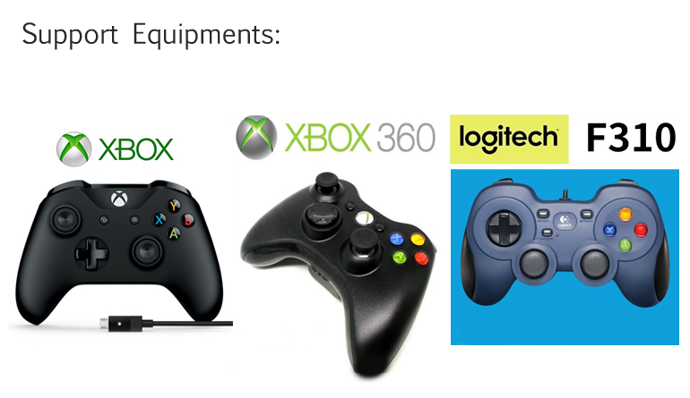

[](https://www.youtube.com/watch?v=cF4athGTqXw)

# D3-XPAD

### 更新日期: 2020-12-24 00:30:00 ver.0005C

-----

## 目錄
1. [關於 D3-XPAD :: About](https://github.com/ccutmis/d3-gamepad#1-%E9%97%9C%E6%96%BC-d3-xpad--about)
2. [下載與安裝 :: Download & Install](https://github.com/ccutmis/d3-gamepad#2-%E4%B8%8B%E8%BC%89%E8%88%87%E5%AE%89%E8%A3%9D%E7%A7%BB%E9%99%A4--download--install)
3. [如何使用 :: How to Use](https://github.com/ccutmis/d3-gamepad#3-%E5%A6%82%E4%BD%95%E4%BD%BF%E7%94%A8--how-to-use)
4. [注意事項 :: Notice](https://github.com/ccutmis/d3-gamepad#4-%E6%B3%A8%E6%84%8F%E4%BA%8B%E9%A0%85--notice)
5. [特別聲明 :: Statement](https://github.com/ccutmis/d3-gamepad#5-%E7%89%B9%E5%88%A5%E8%81%B2%E6%98%8E--statement)
6. [更新日誌 :: Log](https://github.com/ccutmis/d3-gamepad#6-%E6%9B%B4%E6%96%B0%E6%97%A5%E8%AA%8C--log)
7. [參考資源 :: References](https://github.com/ccutmis/d3-gamepad#7-%E5%8F%83%E8%80%83%E8%B3%87%E6%BA%90--references)

-----

## 1. 關於 D3-XPAD :: About

開發這個小程式的起因是在巴哈暗黑III論壇看到有網友詢問能否用XBOX搖桿玩PC版D3，當時想到可以用Python寫一個小程式獲取搖桿輸入然後模擬鍵盤滑鼠輸入，程式開發大約花了一周把大部份問題處理好，然後有巴友回報他用XBOX ONE手把沒法使用這個小程式，經過一些研究後發現先前寫好的 D3-Gamepad-Mapper，只能用XBOX360手把執行(感謝巴哈網友測試回報)。

為了讓程式能支援更多不同類型手把，這邊把原本的Reposite作廢，重新開一個新的Reposite:D3-Gamepad並用XInput-Python模組為核心獲取搖桿輸入，現在程式可以在Win10環境使用XBOX360及XBOX ONE手把玩D3 (Win7測試可玩但建議OS升到Win10)。
未來或許會加上對PS搖桿的支援(時間未定)

-----

## 2. 下載與安裝移除 :: Download & Install

D3-XPAD下載點:

[XPAD-0005C.zip](XPAD-0005C.zip)

下載並解壓縮會得到一個 dist 資料夾，裡面有二個檔案:

* xpad.exe (主程式直接點兩下即可執行)
* xinput.ini (搖桿對應設定檔，建議使用Notepad++編輯)
本軟體無需安裝，將下載完成解壓縮的資料夾放到桌面(或好找的路徑)即完成部署。程式執行時不會修改電腦機碼，若要移除就是直接把主程式跟設定檔刪除即可。

### xinput.ini 設定檔內容

```
#這是一行註解

#設定要啟用搖桿對應的程式標題文字，防止在切換不同視窗程式時可能造成的誤操作
ACTIVE_WIN_TITLE="暗黑破壞神III"

#key_config字典用來定義按鍵值(設""則該鍵無作用)
KEY_CONFIG={
	"A":"1",
	"B":"2",
	"X":"3",
	"Y":"4",
	"BACK":"t",
	"START":"q",
	"DPAD_UP":"tab",
	"DPAD_DOWN":"m",
	"DPAD_LEFT":"i",
	"DPAD_RIGHT":"s",
	"LEFT_SHOULDER":"esc",
	"RIGHT_SHOULDER":"LM",
	"LEFT_TRIGER":"space",
	"RIGHT_TRIGER":"RM"
}

#設定按鍵改為ON/OFF模式，就是按一下就保持按下狀態，再按一下就取消，
#目前設定所有按鍵關閉此功能，可依自己需求作更改，1為ON，0為OFF，本功能需小心使用。
KEY_ONOFF_MODE={
	"A":0,
	"B":0,
	"X":0,
	"Y":0,
	"BACK":0,
	"START":0,
	"DPAD_UP":0,
	"DPAD_DOWN":0,
	"DPAD_LEFT":0,
	"DPAD_RIGHT":0,
	"LEFT_SHOULDER":0,
	"RIGHT_SHOULDER":0,
	"LEFT_TRIGER":0,
	"RIGHT_TRIGER":0
}

#設定左小搖桿在控制滑鼠移動後是否按一下滑鼠左鍵
#設為 True 則在左小搖桿控制滑鼠移動後會在滑鼠所在位置按一下左鍵，要取消則設為 False
SET_LEFT_CONTROLLER_MOVE_AND_CLICK = True
#設定左小搖桿控制滑鼠移動後會點的鍵，假如 SET_LEFT_CONTROLLER_MOVE_AND_CLICK 為 True
LEFT_CONTROLLER_CLICK_VAL = "LM"

#左右小搖桿控制滑鼠位移的一單位(像素)(基本上勿動)
XY_OFFSET_UNIT=8

#延時設定(基本上勿動)
DELAY_SECOND=0.05

#Y軸中心點修正(基本上勿動)
Y_CENTER_OFFSET=-(XY_OFFSET_UNIT*7)

#勿動BTN_DICT及BTN2_DICT
BTN_DICT={ "A":0, "B":1, "X":2, "Y":3, "BACK":4, "START":5, "DPAD_UP":6, "DPAD_DOWN":7, "DPAD_LEFT":8, "DPAD_RIGHT":9, "LEFT_SHOULDER":10, "RIGHT_SHOULDER":11, "LEFT_TRIGER":12, "RIGHT_TRIGER":13 }
BTN2_DICT={ 0:"A", 1:"B", 2:"X", 3:"Y", 4:"BACK", 5:"START", 6:"DPAD_UP", 7:"DPAD_DOWN", 8:"DPAD_LEFT", 9:"DPAD_RIGHT", 10:"LEFT_SHOULDER", 11:"RIGHT_SHOULDER", 12:"LEFT_TRIGER", 13:"RIGHT_TRIGER" }
#是否啟用degug模式(勿動) 預設值為False
DEBUG_MODE=False


```


修改 xinput.ini 注意事項:
1. 編輯此文件推薦使用Notepad++，如果用記事本編輯在存檔時需注意是否存為"utf-8"文件格式(不可為"Big5"或"utf-8 BOM"格式會出錯)。
2. 只能更改KEY_CONFIG字典裡的值，例如: "A":"1" 改成 "A":"i"，這樣執行程式時按下搖桿A鍵就會模擬按下i鍵，只可修改值不可破壞格式。

-----

## 3. 如何使用 :: How to Use

1. 先開啟Diablo III，將畫面顯示設為"全螢幕視窗模式"或"視窗模式"。(這個很重要)
2. 確定你的xbox搖桿有接在PC端並正常運作中(可在控制台裡的裝置及印表機項目確認)
3. 執行 xpad.exe 並切換到 Diablo III，拿起搖桿測試看看。
4. 要結束 xpad.exe 很簡單，同時按住控制器的 (LEFT_SHOULDER)+(RIGHT_SHOULDER)+(X) 程式會直接結束。

-----

## 4. 注意事項 :: Notice

### 設備需求:
1. Windows10作業系統(Win7測試可玩但建議OS升到Win10)
2. 目前測試可支援的PC相容搖桿為XBOX360、XBOX ONE、羅技F310，其它搖桿不確定是否可正常運作。



-----

## 5. 特別聲明 :: Statement

* 本程式無償提供任何人使用，歡迎轉載連結。
* 本程式執行時會依搖桿輸入模擬鍵盤滑鼠動作，若在執行中造成任何非預期之損失概不負責，特此聲明。
* 目前程式基本運作應該是沒問題的，建議在執行xpad.exe的時候先不要開啟 Diablo III以外的任何程式，試試看有沒有問題，當然程式不可能完全沒bugs，未來有修正版會在這邊持續更新。

-----

## 6. 更新日誌 :: Log

### 更新日期: 2020-12-24 00:30:00 ver.0005C
更新內容:
* 修正R_TRIGER有時會自己重覆施放及監控目標視窗的bug

### 更新日期: 2020-12-21 21:00:00 ver.0003C-Hotfix
更新內容:
* 今天試玩的時候發現在遊戲中LEFT_TRIGER與RIGHT_TRIGER會有不正常的反應，比如說按REFT_TRIGER後會自己不間斷的施放，有點類似系統收到了按下右鍵的訊號，但是放開右鍵的訊號漏掉了。重新檢視原碼並作適當的修正，目前應該能正常運作了。


### 更新日期: 2020-12-20 11:00:00 ver.0003C
更新內容:
* 重整 xpad.py 混亂的代碼 將class整合到Modules裡
* 由於必須改寫XInput.py裡某個class的建構式才能做到class重整，因此將XInput.py整合到Modules裡，未來XInput-Python就不需安裝了
* 追加設定檔功能: 設定按鍵為ON/OFF模式
* 追加用控制器關閉程式的按鍵組合:LEFT_SHOULDER+RIGHT_SHOULDER+X
* 優化判斷當前作用視窗部份(原本在主程式&Class的按鍵搖桿事件裡都會判斷一次，這樣造成重覆運算浪費資源，現在重寫為只在主程式裡判斷

### 更新日期: 2020-12-14 12:30:00 ver.0002C
更新內容:
* 廢除舊版Repo:d3-gamepad-mapper 發佈新版Repo:d3-gamepad 並將主程式 main.py 重新命名為 xpad.py
* 廢除舊版Repo:d3-gamepad-mapper 網址: https://github.com/ccutmis/d3-gamepad-mapper

-----

## 7. 參考資源 :: References

### xpad.py 編譯參考資料
* resource url: https://github.com/Zuzu-Typ/XInput-Python
* 需安裝的套件 pypiwin32 XInput-Python pynput==1.6.8
* 要在win7能正常運作需把XInput.py裡第140~145行註解掉

### D3官網對於家機搖桿的設置參考
https://diablo3.blizzard.com/en-us/game/guide/gameplay/fundamentals

### pygame.joystick(參考頁面里的搖桿分類)
https://www.pygame.org/docs/ref/joystick.html

### get controller event:
https://stackoverflow.com/questions/60309652/how-to-get-usb-controller-gamepad-to-work-with-python

### control mouse action:
https://stackoverflow.com/questions/4263608/ctypes-mouse-events

### simulor keydown:
https://stackoverflow.com/questions/11906925/python-simulate-keydown/11910555

### pynput使用簡單說明
https://www.itread01.com/content/1541887278.html

